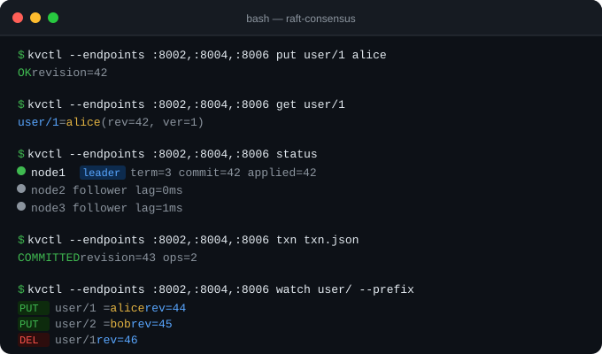
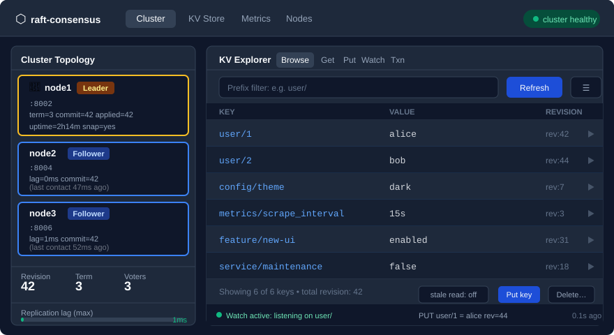

<p align="center">
  <br>
  <strong style="font-size:28px">raft-consensus</strong>
  <br><br>
  <em>Production-grade distributed key/value store built on a from-scratch Raft implementation in Go</em>
</p>

<p align="center">
  <a href="https://github.com/sanskarpan/raft-consensus/actions/workflows/ci.yml"></a>&nbsp;
  <a href="https://go.dev/dl/"></a>&nbsp;
  <a href="https://goreportcard.com/report/github.com/sanskarpan/raft-consensus"></a>&nbsp;
  &nbsp;
  <a href="./LICENSE"></a>
</p>

<p align="center">
  
</p>

`raftd` is a replicated key/value store where a cluster of nodes stays in agreement using [Raft consensus](https://raft.github.io/raft.pdf). Writes commit to a majority before being acknowledged. Reads are **linearizable by default** — a heartbeat quorum confirms the leader still holds quorum before serving data, so a partitioned stale leader can never return stale reads. Stale local reads are opt-in for speed.

It ships a REST API, Go client library, `kvctl` CLI, gRPC and TCP transports, mTLS peer encryption, compare-and-swap transactions, SSE watches with history replay, Prometheus metrics, OpenTelemetry traces, and a React dashboard.

---

## Quickstart

Requires Go 1.25+. Builds in ~10 seconds:

```bash
git clone https://github.com/sanskarpan/raft-consensus.git
cd raft-consensus
go build -o raftd ./cmd/raftd
go build -o kvctl ./cmd/kvctl
```

Start a 3-node cluster locally (raft ports 8011/8013/8015, HTTP 8002/8004/8006):

```bash
./raftd -config config-node1.yaml &
./raftd -config config-node2.yaml &
./raftd -config config-node3.yaml &
```

```bash
export EP=localhost:8002,localhost:8004,localhost:8006

kvctl --endpoints $EP put user/1 alice        # write
kvctl --endpoints $EP get user/1              # linearizable read
kvctl --endpoints $EP get user/1 --stale      # fast local read
kvctl --endpoints $EP status                  # cluster health
kvctl --endpoints $EP watch user/ --prefix    # SSE stream (Ctrl-C to stop)
```

> **Auth:** the sample configs have `allow_no_auth: true` already set for local dev. In production, set `admin_tokens: {mytoken: write}` and pass `--token mytoken`.

Or spin up the cluster with Docker Compose — no Go toolchain needed:

```bash
docker compose -f scripts/docker/docker-compose.yml up --build
curl -s localhost:8002/v1/status | jq .
```

---

## Dashboard

<p align="center">
  
</p>

The React/Vite dashboard (`ui/`) lets you explore the cluster, browse and edit keys, stream live watch events, inspect replication lag, and trigger snapshots — all from a browser.

```bash
cd ui && npm install && npm run dev    # → http://localhost:5173
```

---

## What's inside

| Layer | Description |
|-------|-------------|
| **Raft core** | Leader election with randomized timeouts, log replication with group-commit batching, conflict-term fast-backup, snapshots with streaming `InstallSnapshot`, joint-consensus safe membership changes, learner nodes |
| **ReadIndex** | Heartbeat-quorum linearizable reads — never hit the log, never return stale data; opt-in stale reads skip the round-trip |
| **WAL** | Segment-based (64 MiB) write-ahead log, per-record CRC32, fsync-on-append, concurrent-safe per-call file descriptors |
| **KV FSM** | Versioned keys with create/mod revision + version counter, compare-and-swap `Txn`, ring-buffer event history (1024 entries) |
| **Watches** | SSE streams for exact-key or prefix; revision-based history replay; automatic client reconnect with `Last-Event-ID`; per-IP + global caps |
| **Transport** | JSON-over-TCP (default) or gRPC; TLS 1.3 / mTLS with client-cert verification; `require_tls` fail-closed mode |
| **Security** | Token auth with `read`/`write` roles; per-IP + global token-bucket rate limiting; CORS deny-by-default; request-body size cap (1 MiB); auth fails closed |
| **Observability** | Prometheus at `/metrics`, OpenTelemetry/OTLP traces, structured Zap logging, auth-gated pprof |
| **Admin UI** | React/Vite dashboard: cluster topology, KV explorer (browse/edit/watch/txn tabs), metrics, node control, snapshot manager |

---

## Architecture

```
                       ┌──────────────────────────────────────────┐
  kvctl / curl / UI ──►│  HTTP API (:http_addr)                    │
  Go client            │  /v1/kv  /v1/txn  /v1/watch  /v1/status  │
                       │  /command  /admin/*  /health  /metrics    │
                       └──────────────────┬───────────────────────┘
                                          │  leader-forwards writes + lin-reads
                                          ▼
┌───────────────┐  Raft RPCs  ┌───────────────┐  Raft RPCs  ┌───────────────┐
│    node1      │◄───────────►│    node2      │◄───────────►│    node3      │
│  (leader)     │  TCP/gRPC   │  (follower)   │  TLS/mTLS   │  (follower)   │
├───────────────┤             ├───────────────┤             ├───────────────┤
│ Raft core     │AppendEntries│ Raft core     │RequestVote  │ Raft core     │
│ WAL + Stable  │Snapshot     │ WAL + Stable  │TimeoutNow   │ WAL + Stable  │
│ KV FSM        │             │ KV FSM        │             │ KV FSM        │
│ WatchManager  │             │ WatchManager  │             │ WatchManager  │
└───────────────┘             └───────────────┘             └───────────────┘
```

**Write path:** client → any node → forward to leader → `Apply` appends to WAL and replicates → committed once a quorum acks → applied to KV FSM → response returned.

**Linearizable read:** leader confirms it still holds quorum (ReadIndex heartbeat), waits for `applyIndex ≥ readIndex`, then serves from local FSM state — no log entry written.

**Stale read:** served directly from the local FSM under `RLock` — zero network round-trips.

See [docs/architecture.md](docs/architecture.md) for the full deep-dive.

---

## Transactions

Compare-and-swap transactions let you atomically gate writes on key state:

```bash
# If user/1 == "alice" → update it; else → return current value
kvctl --endpoints $EP txn - <<'EOF'
{
  "compare": [{"key":"user/1","target":"value","result":"equal","value":"alice"}],
  "success": [{"type":0,"key":"user/1","value":"alice-updated"}],
  "failure": [{"type":1,"key":"user/1"}]
}
EOF
```

Or with the HTTP API:

```bash
curl -X POST localhost:8002/v1/txn -H "Authorization: Bearer $T" -d '{
  "compare":[{"key":"user/1","target":"value","result":"equal","value":"alice"}],
  "success":[{"type":0,"key":"user/1","value":"alice-updated"}],
  "failure":[]
}'
```

---

## HTTP API reference

All write endpoints require `Authorization: Bearer <token>` unless `allow_no_auth: true`. Health and readiness endpoints are always open.

| Method | Path | Role | Description |
|--------|------|------|-------------|
| `PUT` | `/v1/kv/{key}` | write | Create or update a key |
| `GET` | `/v1/kv/{key}` | read | Linearizable get (default) or `?consistency=stale` |
| `GET` | `/v1/kv?prefix=pfx/` | read | Range scan by prefix (max 10 000 results) |
| `DELETE` | `/v1/kv/{key}` | write | Delete a key |
| `POST` | `/v1/txn` | write | Compare-and-swap transaction |
| `GET` | `/v1/watch?key=k` | read | SSE watch stream (also `?prefix=p/`) |
| `GET` | `/v1/status` | read | Cluster status, revision, dropped-event counters |
| `POST` | `/command` | write | Raw Raft apply (legacy; prefer `/v1/kv`) |
| `POST` | `/admin/snapshot` | write | Trigger a snapshot on this node |
| `POST` | `/admin/members` | write | Add a voting member (joint consensus) |
| `DELETE` | `/admin/members/{id}` | write | Remove a member |
| `POST` | `/admin/members/{id}/promote` | write | Promote learner → voter |
| `GET` | `/metrics` | — | Prometheus metrics |
| `GET` | `/health` | — | Liveness (always 200) |
| `GET` | `/ready` | — | Readiness (200 when FSM is up to date) |

Full reference with request/response schemas: [docs/api.md](docs/api.md).

---

## kvctl command reference

```bash
# Global flags
kvctl [--endpoints ep1,ep2,...] [--token TOKEN] [--timeout 5s] [--stale] COMMAND

kvctl put KEY VALUE               # write a key
kvctl get KEY                     # linearizable read
kvctl get KEY --stale             # fast local read
kvctl delete KEY                  # delete a key
kvctl range PREFIX/               # list all keys under prefix
kvctl txn FILE.json               # run a compare-and-swap transaction (stdin with -)
kvctl watch KEY                   # stream changes to one key
kvctl watch PREFIX/ --prefix      # stream all changes under prefix
kvctl status                      # cluster leader, term, revision, node lag
kvctl completion bash|zsh|fish    # emit shell completion script
```

Install completions:

```bash
# bash
kvctl completion bash >> ~/.bash_completion

# zsh
kvctl completion zsh > "${fpath[1]}/_kvctl"

# fish
kvctl completion fish > ~/.config/fish/completions/kvctl.fish
```

---

## Configuration reference

`raftd` reads a YAML file passed with `-config` (default `raftd.yaml`). Key options:

| Key | Default | Description |
|-----|---------|-------------|
| `node_id` | *(required)* | Unique node ID; must appear in `cluster`. |
| `listen_addr` | `:8080` | Raft RPC listen address. |
| `http_addr` | `:8081` | HTTP API listen address. |
| `data_dir` | `./data` | Base data directory; files go under `data_dir/<node_id>/`. |
| `cluster` | *(required)* | Initial members: `[{id, address, http_address}]`. |
| `election_tick` | `10` | Election timeout in ticks (must be ≥ 3× `heartbeat_tick`). |
| `heartbeat_tick` | `1` | Heartbeat interval in ticks (1 tick = 50 ms). |
| `transport` | `tcp` | Raft transport: `tcp` or `grpc`. |
| `admin_tokens` | `{}` | `{token: role}` map; role is `read` or `write`. |
| `allow_no_auth` | `false` | Dev only — skip auth entirely. Auth **fails closed** by default. |
| `tls_cert` / `tls_key` / `tls_ca` | `""` | Peer TLS/mTLS cert, key, CA. |
| `require_tls` | `false` | Fail closed: reject unencrypted peer connections. |
| `https_cert` / `https_key` | `""` | Enable TLS on the HTTP API (both required together). |
| `rate_limit_rps` | `500` | Global write requests/sec (token bucket). |
| `per_ip_rate_limit_rps` | `50` | Per-client-IP write requests/sec. |
| `max_watch_connections` | `1024` | Global cap on concurrent SSE streams. |
| `otlp_endpoint` | `""` | OTLP/gRPC endpoint for traces (e.g. `localhost:4317`). |
| `debug_addr` | `""` | pprof listen address (auth-gated). |

Full reference including internal Raft tunables and all env overrides: [docs/configuration.md](docs/configuration.md).

---

## Kubernetes / Helm

```bash
helm install my-raft ./charts/raft \
  --set replicaCount=3 \
  --set image.repository=raftd \
  --set image.tag=0.1.0 \
  --set config.adminToken=$(openssl rand -hex 32)
```

The chart deploys a StatefulSet with a per-pod PVC, ClusterIP + headless Services, and a rendered config ConfigMap. See [docs/deployment.md](docs/deployment.md) for sizing, cert generation, and rolling upgrades.

---

## Benchmarks

Micro-benchmarks live alongside the unit tests and run in CI on every PR:

```bash
go test -bench=. -benchmem -benchtime=50x -count=6 \
    ./pkg/fsm/ ./pkg/storage/ ./pkg/transport/
```

Representative numbers on Apple M3 Pro (darwin/arm64):

| Benchmark | ns/op | B/op | allocs/op |
|-----------|------:|-----:|----------:|
| `BenchmarkFSMApplyPut` | 1 071 | 907 | 11 |
| `BenchmarkFSMApplyTxn` | 3 456 | 1 722 | 29 |
| `BenchmarkEncodeRecord` | 42 | 64 | 1 |
| `BenchmarkWALGet` | 4 588 | 144 | 4 |
| `BenchmarkWALGetParallel` | 8 096 | 384 | 5 |

CI uses `benchstat` to compare PR results against the merge-base on the same linux/amd64 runner and flags regressions. A committed baseline for developer reference lives in [benchmarks/baseline.txt](benchmarks/baseline.txt).

---

## Security

Two trust boundaries:

- **Client ↔ node** — token auth with `read`/`write` roles; optional HTTPS on the API; per-IP and global rate limiting; 1 MiB request-body cap; CORS deny-by-default.
- **Node ↔ node** — optional TLS 1.3 / mTLS between peers; `require_tls: true` for fail-closed operation; gRPC per-peer member allowlist.

Auth **fails closed**: no tokens configured + `allow_no_auth` unset = every request rejected.

Generate mTLS dev certs:

```bash
bash scripts/certs/generate.sh   # outputs to scripts/certs/generated/
```

Full threat model and hardening checklist: [docs/security.md](docs/security.md).

---

## Testing

```bash
go test -race ./...                          # all unit tests
go test -race ./tools/testharness/           # 3-node process-based E2E
go test -v ./tools/lincheck/                 # porcupine linearizability check
go test -v ./tools/soaktest/ -soak.duration=60s   # sustained-write soak
go test -v ./tools/chaos/                    # leader failover / partition
```

The linearizability checker (`tools/lincheck/`) starts a real 3-node cluster, runs 4 concurrent workers issuing puts and gets for 5 seconds, then verifies the recorded history is linearizable per key using [porcupine](https://github.com/anishathalye/porcupine). All 596 operations in a typical run verify as linearizable.

CI runs all tests with `-race` on Go 1.26.5 and 1.25.x, plus golangci-lint, staticcheck, govulncheck, and a multi-arch Docker smoke test on every push.

---

## Documentation

| Doc | Contents |
|-----|----------|
| [docs/architecture.md](docs/architecture.md) | Components, Raft algorithm, write/read paths, on-disk formats |
| [docs/api.md](docs/api.md) | Full HTTP API + kvctl command reference |
| [docs/configuration.md](docs/configuration.md) | Every config key, flag, and env var |
| [docs/deployment.md](docs/deployment.md) | Binary, Docker, Kubernetes/Helm, TLS, rolling upgrades |
| [docs/operations.md](docs/operations.md) | Runbook: health, metrics, alerts, backup/restore, scaling |
| [docs/security.md](docs/security.md) | Security model, threat model, hardening checklist |
| [docs/testing.md](docs/testing.md) | Test architecture: unit, integration, chaos, linearizability |
| [docs/transactions.md](docs/transactions.md) | Transaction protocol and atomicity guarantees |
| [docs/watches.md](docs/watches.md) | SSE streaming: key/prefix watches, revision history, reconnect |
| [docs/transport.md](docs/transport.md) | TCP binary, gRPC, TLS/mTLS configuration |
| [docs/tuning.md](docs/tuning.md) | Throughput vs durability, benchmark interpretation |
| [docs/observability.md](docs/observability.md) | Metrics reference, Grafana dashboard templates, alerts |
| [docs/disaster-recovery.md](docs/disaster-recovery.md) | Data restoration and disaster recovery procedures |

---

## License

Licensed under the [Apache License 2.0](./LICENSE).
